<p align="center">
  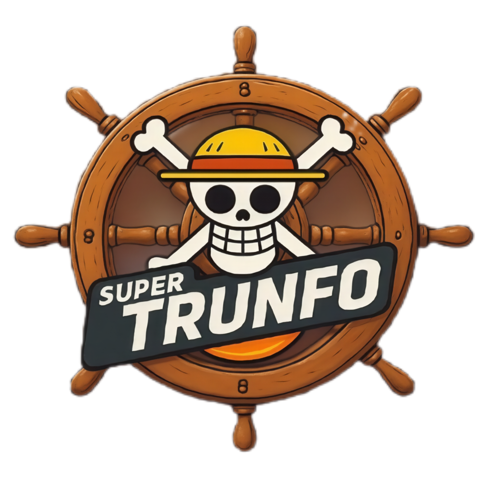
</p>
<h1 align="center">Super Trunfo - One Piece</h1>

Este é um jogo mobile de cartas inspirado no clássico **Super Trunfo**, com personagens icônicos do anime **One Piece**. Desenvolvido como projeto final do módulo de Desenvolvimento Mobile no Serratec, o jogo combina estratégia, sorte e um toque de pirataria!


## 👥 Equipe Desenvolvedora

<table align="center">
<tr>
<td align="center">
<br>
<sub><b>👨‍💻 Carlos Leonardo</b></sub><br>
<a href="https://github.com/OtolineLeo">@OtolineLeo</a><br>

</td>
<td align="center">
<br>
<sub><b>👨‍💻 Domingos Machado</b></sub><br>
<a href="https://github.com/DomingosMachado">@DomingosMachado</a><br>

</td>
<td align="center">
<br>
<sub><b>👩‍💻 Lívia Raissinger</b></sub><br>
<a href="https://github.com/Livia9">@Livia9</a><br>

</td>
</tr>
<tr>
<td align="center">
<br>
<sub><b>👨‍💻 Patrick Oliveira</b></sub><br>
<a href="https://github.com/oliveirap11">@oliveirap11</a><br>

</td>
<td align="center">
<br>
<sub><b>👩‍💻 Rayca Thais</b></sub><br>
<a href="https://github.com/raycaThais">@raycaThais</a><br>

</td>
<td align="center">
<br>
<sub><b>👨‍💻 Victor da Silva Campos</b></sub><br>
<a href="https://github.com/CamposVictor8991">@CamposVictor8991</a><br>

</td>
</tr>
</table>


## 📱 Funcionalidades

- 🎴 Cartas com personagens de One Piece e seus atributos
- 🔐 Tela de login com validação
- 🌐 Integração com APIs para dados dinâmicos
- 🌑 Tema claro/escuro com alternância via Context API
- 💾 Persistência de tema e de usuário com AsyncStorage
- 🧠 Rodadas automáticas com lógica de comparação
- 🔄 Bot que joga com lógica simples, escolhendo seu melhor atributo
- ⭐ Carta "Super Trunfo" que vence qualquer rodada
- 🏆 Contador de pontos e sistema de vitória
- 🧭 Navegação entre telas com React Navigation

---

## 🎮 Regras do Jogo

- Todas as cartas são embaralhadas e divididas igualmente.
- Cada jogador recebe 5 cartas.
- O jogo termina após 5 rodadas ou quando alguém faz 5 pontos.
- O jogador sempre começa a primeira rodada.

### 👊 Como jogar

- Na sua vez, revele sua carta e escolha um atributo.
- O bot revela a carta dele e compara o mesmo atributo.
- Quem tiver o maior valor vence a rodada.
- O vencedor joga primeiro na próxima rodada.
- Em caso de empate, ninguém pontua e novas cartas são usadas.
- O bot escolhe automaticamente seu melhor atributo na vez dele.

### ⭐ Carta Super Trunfo

- Se a carta especial aparecer, ela vence qualquer rodada automaticamente.

### 🏁 Fim do jogo

- O primeiro a conquistar 5 pontos é declarado o campeão!

---

## 🛠️ **Tecnologias Utilizadas**  
| **Tecnologia**       | **Uso**                                                                 |
|----------------------|-------------------------------------------------------------------------|
|  | Desenvolvimento mobile |
|  | Tipagem estática |
|  | Navegação entre telas |
|  | Persistência de dados (tema e usuário logado) |
|  | Gerenciamento de estado (tema claro/escuro) |


---

## 🧪 Como Rodar o Projeto

1. Clone o repositório:
   ```bash
   git clone https://github.com/raycaThais/serratec-projeto-final-Desenvolvimento-Mobile.git
   cd serratec-projeto-final-Desenvolvimento-Mobile


2. Instale as dependências:

   ```bash
   npm install
   # ou
   yarn
   ```

3. Execute o app com Expo:

   ```bash
   npx expo start
   ```

4. Use o app **Expo Go** para escanear o QR code e testar no celular.
---

## 📷 Imagens do Aplicativo Desenvolvido

### 🎨 Tema Claro

<p align="center">
   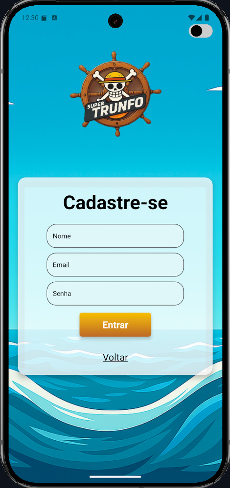 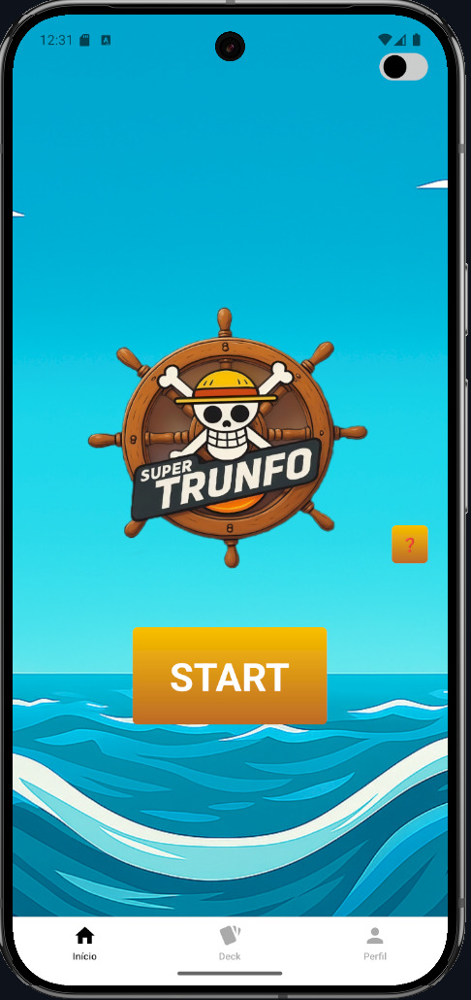 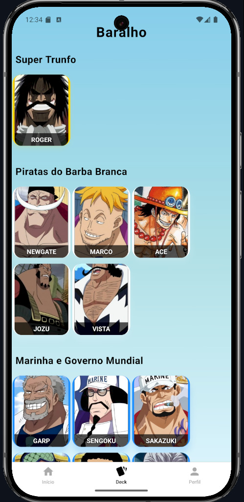 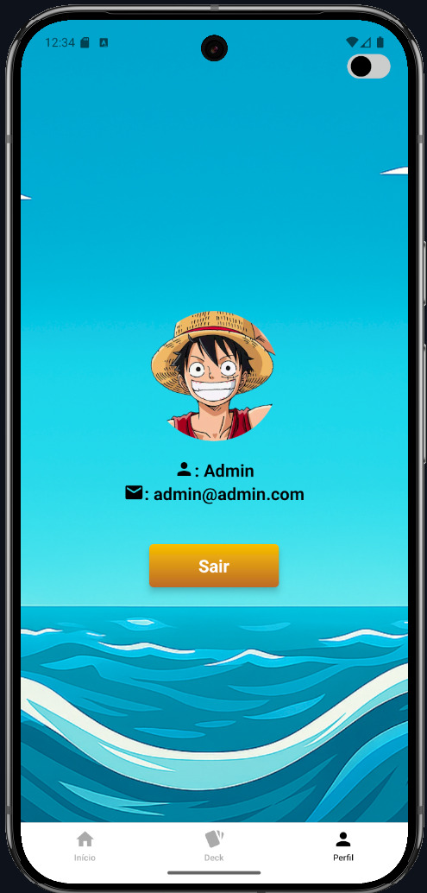 </p>

---

### 🌑 Tema Escuro

<p align="center"> 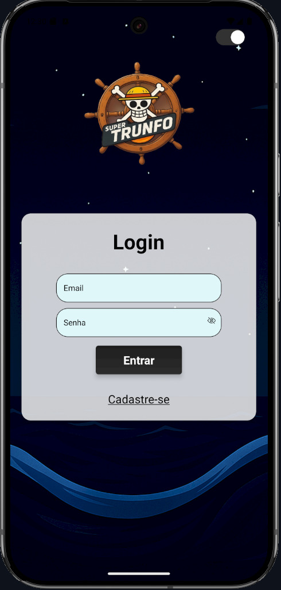 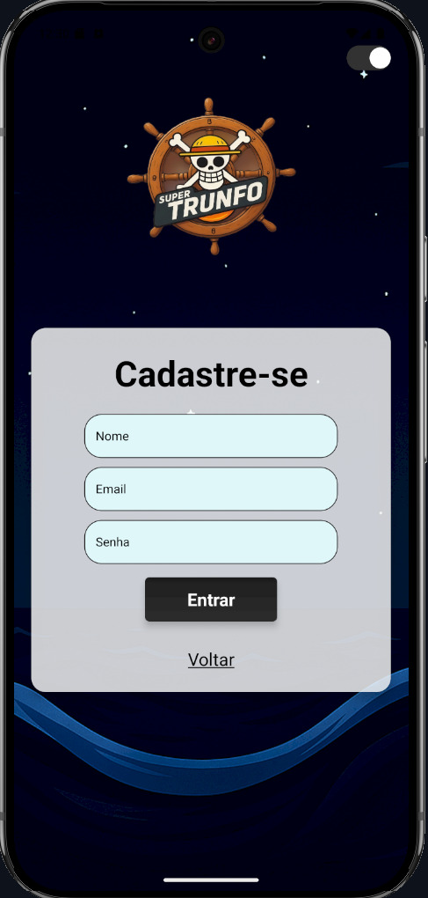 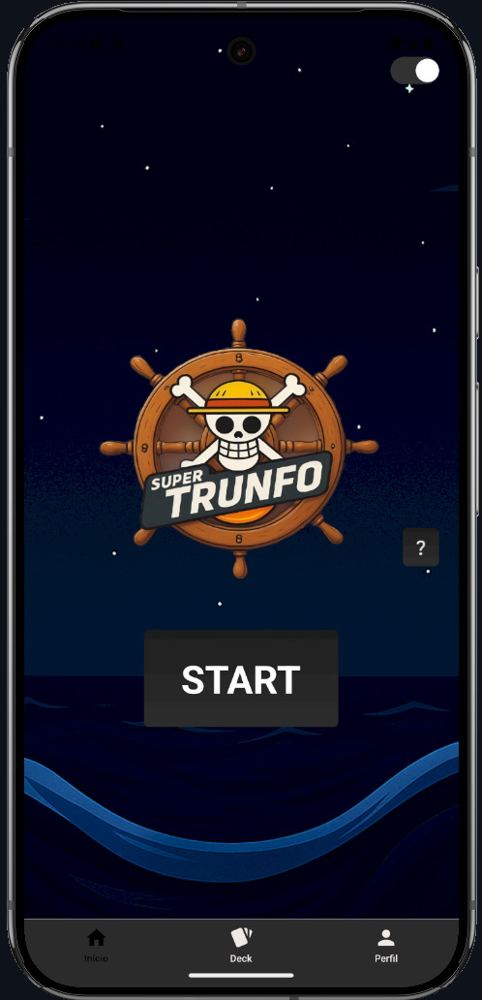 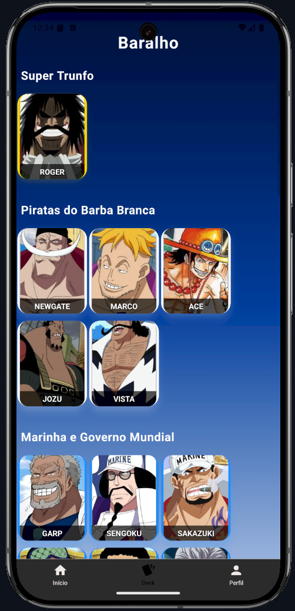 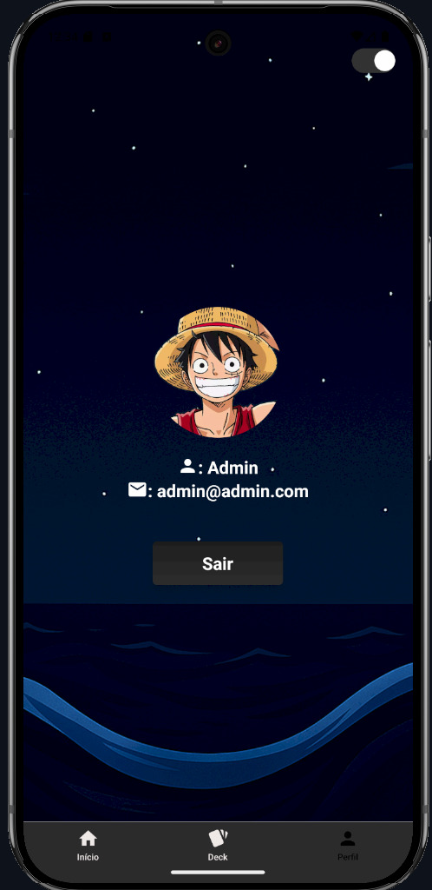 </p> 

---

### 🃏 Telas de Jogo
<p align="center">  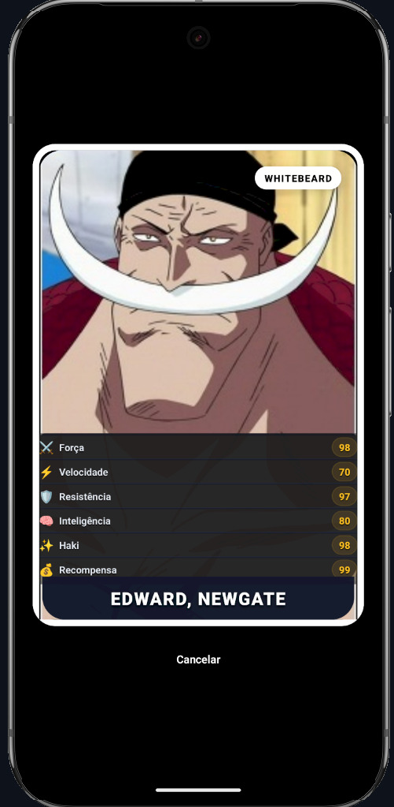 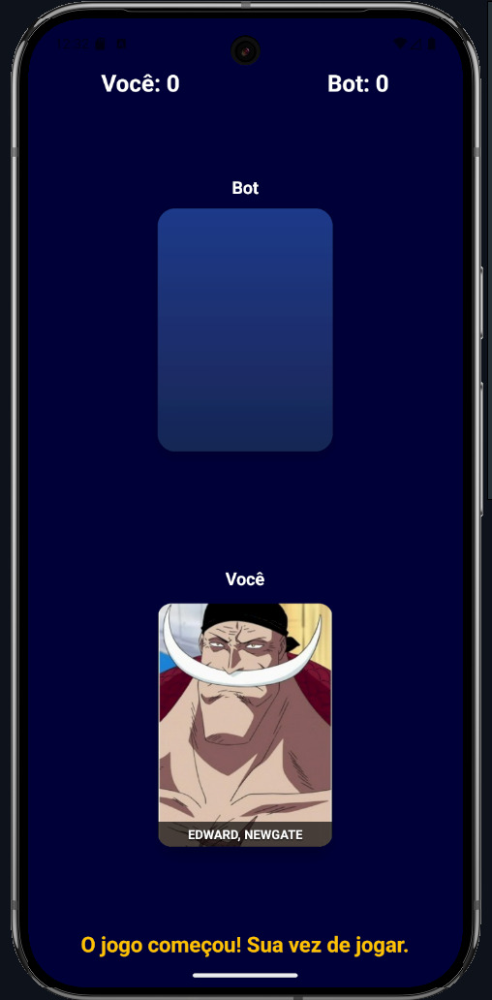 </p> 

